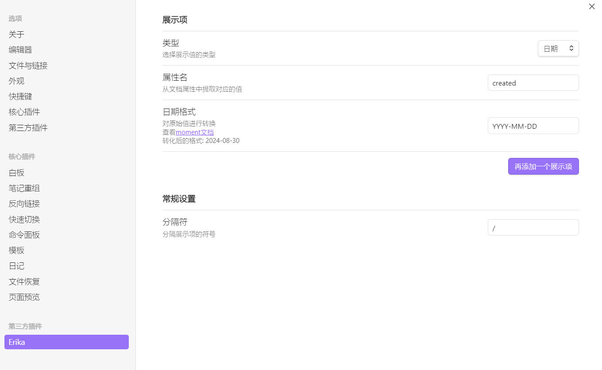

  <a href="./README.md">English</a>
  中文

# erika

## 介绍

提取文档属性的值，展示在文件树中

## 截图

## 参考

部分代码参考自下列仓库

+ [novel-word-count-obsidian](https://github.com/isaaclyman/novel-word-count-obsidian)
+ [file-explorer-note-count](https://github.com/ozntel/file-explorer-note-count)
